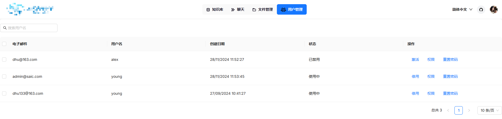
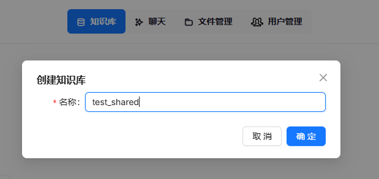
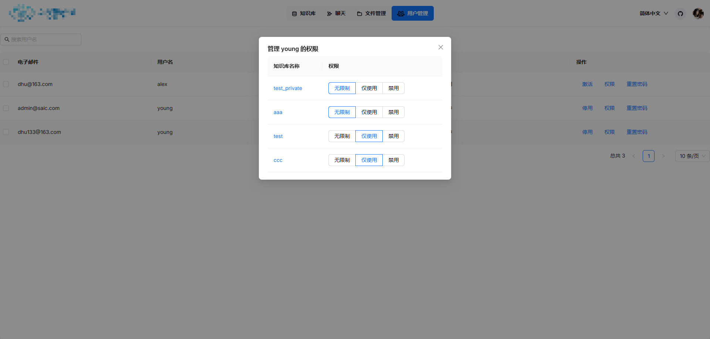

###  基于RAGFlow0.7添加了用户管理、权限分配、共享知识库若干功能。

###  以下图标以及对应的翻译README文件均来自原[RAGFlow](https://github.com/infiniflow/ragflow)的README文件

  <a href="./README_en.md">English</a> |
  <a href="./README_zh.md">简体中文</a> |
  <a href="./README_ja.md">日本語</a>

----

我在原有基础上添加了一个管理员专用页面，用于管理用户，可以对用户的状态、对知识库的权限进行修改以及密码的重置。

以下为共享知识库的实现：由于在一个团体中，有一些文件是大家都需要使用的，如果每个人都自己创建对应的知识库，那么就会造成大量重复的工作。因此，我新增了共享知识库的功能，在管理员处可以创建一个新的知识库，默认为共享。那么此时会同步到各个用户的知识库列表中。（下面第一张图是管理员新建知识库，第二张是普通用户知识库列表）

下为对用户所拥有的知识库权限进行修改；当然也可以对状态以及密码进行修改，就不放图了

