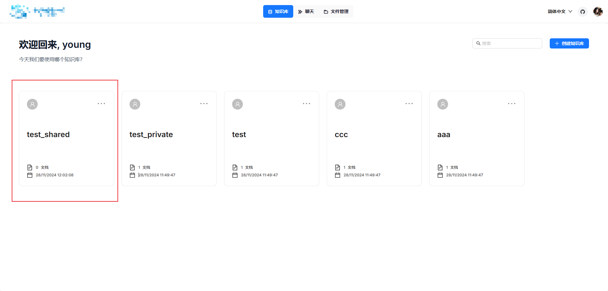

😉 **基于RAGFlow0.7添加了用户管理、权限分配、共享知识库若干功能。**

:smile:首先在原有基础上添加了一个管理员专用页面，用于管理用户，可以对用户的状态、对知识库的权限进行修改以及密码的重置。


✨ **共享知识库**：

由于在一个团体中，有一些文件是大家都需要使用的，如果每个人都自己创建对应的知识库，那么就会造成大量重复的工作。因此，我新增了共享知识库的功能，在管理员处可以创建一个新的知识库，默认为共享，那么此时会同步到各个用户的知识库列表中。（下面第一张图是管理员新建知识库，第二张是普通用户知识库列表）




🍗 下为对用户所拥有的知识库权限进行修改；当然也可以对状态以及密码进行修改，就不放图了


源码启动可参考下文

##### 以下内容来自原[RAGFlow](https://github.com/infiniflow/ragflow)的README文件

<div align="center">
<a href="https://demo.ragflow.io/">

</a>
</div>


<p align="center">
  <a href="./README_en.md">English</a> |
  <a href="./README_zh.md">简体中文</a> |
  <a href="./README_ja.md">日本語</a>
</p>


## 💡 RAGFlow 是什么？

[RAGFlow](https://ragflow.io/) 是一款基于深度文档理解构建的开源 RAG（Retrieval-Augmented Generation）引擎。RAGFlow 可以为各种规模的企业及个人提供一套精简的 RAG 工作流程，结合大语言模型（LLM）针对用户各类不同的复杂格式数据提供可靠的问答以及有理有据的引用。

## 🎮 Demo 试用

请登录网址 [https://demo.ragflow.io](https://demo.ragflow.io) 试用 demo。

<div align="center" style="margin-top:20px;margin-bottom:20px;">

</div>


## 📌 近期更新

- 2024-06-27 Q&A 解析方式支持 Markdown 文件和 Docx 文件。支持提取出 Docx 文件中的图片。支持提取出 Markdown 文件中的表格。
- 2024-06-14 Q&A 解析方式支持 PDF 文件。
- 2024-06-06 支持 [Self-RAG](https://huggingface.co/papers/2310.11511) ，在对话设置里面默认勾选。
- 2024-05-30 集成 [BCE](https://github.com/netease-youdao/BCEmbedding) 和 [BGE](https://github.com/FlagOpen/FlagEmbedding) 重排序模型。
- 2024-05-28 集成大模型 Baichuan 和火山方舟。
- 2024-05-23 实现 [RAPTOR](https://arxiv.org/html/2401.18059v1) 提供更好的文本检索。
- 2024-05-21 支持流式结果输出和文本块获取API。
- 2024-05-15 集成大模型 OpenAI GPT-4o。
- 2024-05-08 集成大模型 DeepSeek。

## 🌟 主要功能

### 🍭 **"Quality in, quality out"**

- 基于[深度文档理解](./deepdoc/README.md)，能够从各类复杂格式的非结构化数据中提取真知灼见。
- 真正在无限上下文（token）的场景下快速完成大海捞针测试。

### 🍱 **基于模板的文本切片**

- 不仅仅是智能，更重要的是可控可解释。
- 多种文本模板可供选择

### 🌱 **有理有据、最大程度降低幻觉（hallucination）**

- 文本切片过程可视化，支持手动调整。
- 有理有据：答案提供关键引用的快照并支持追根溯源。

### 🍔 **兼容各类异构数据源**

- 支持丰富的文件类型，包括 Word 文档、PPT、excel 表格、txt 文件、图片、PDF、影印件、复印件、结构化数据、网页等。

### 🛀 **全程无忧、自动化的 RAG 工作流**

- 全面优化的 RAG 工作流可以支持从个人应用乃至超大型企业的各类生态系统。
- 大语言模型 LLM 以及向量模型均支持配置。
- 基于多路召回、融合重排序。
- 提供易用的 API，可以轻松集成到各类企业系统。

## 🔎 系统架构

<div align="center" style="margin-top:20px;margin-bottom:20px;">

</div>


## 🎬 快速开始

### 📝 前提条件

- CPU >= 4 核

- RAM >= 16 GB

- Disk >= 50 GB

- Docker >= 24.0.0 & Docker Compose >= v2.26.1

  > 如果你并没有在本机安装 Docker（Windows、Mac，或者 Linux）, 可以参考文档 [Install Docker Engine](https://docs.docker.com/engine/install/) 自行安装。

### 🚀 启动服务器

1. 确保 `vm.max_map_count` 不小于 262144：

   > 如需确认 `vm.max_map_count` 的大小：
   >
   > ```bash
   > $ sysctl vm.max_map_count
   > ```
   >
   > 如果 `vm.max_map_count` 的值小于 262144，可以进行重置：
   >
   > ```bash
   > # 这里我们设为 262144:
   > $ sudo sysctl -w vm.max_map_count=262144
   > ```
   >
   > 你的改动会在下次系统重启时被重置。如果希望做永久改动，还需要在 **/etc/sysctl.conf** 文件里把 `vm.max_map_count` 的值再相应更新一遍：
   >
   > ```bash
   > vm.max_map_count=262144
   > ```

2. 克隆仓库：

   ```bash
   $ git clone https://github.com/infiniflow/ragflow.git
   ```

3. 进入 **docker** 文件夹，利用提前编译好的 Docker 镜像启动服务器：

   ```bash
   $ cd ragflow/docker
   $ chmod +x ./entrypoint.sh
   $ docker compose -f docker-compose-CN.yml up -d
   ```

   > 请注意，运行上述命令会自动下载 RAGFlow 的开发版本 docker 镜像。如果你想下载并运行特定版本的 docker 镜像，请在 docker/.env 文件中找到 RAGFLOW_VERSION 变量，将其改为对应版本。例如 RAGFLOW_VERSION=v0.7.0，然后运行上述命令。

   > 核心镜像文件大约 9 GB，可能需要一定时间拉取。请耐心等待。

4. 服务器启动成功后再次确认服务器状态：

   ```bash
   $ docker logs -f ragflow-server
   ```

   _出现以下界面提示说明服务器启动成功：_

   ```bash
       ____                 ______ __
      / __ \ ____ _ ____ _ / ____// /____  _      __
     / /_/ // __ `// __ `// /_   / // __ \| | /| / /
    / _, _// /_/ // /_/ // __/  / // /_/ /| |/ |/ /
   /_/ |_| \__,_/ \__, //_/    /_/ \____/ |__/|__/
                 /____/
   
    * Running on all addresses (0.0.0.0)
    * Running on http://127.0.0.1:9380
    * Running on http://x.x.x.x:9380
    INFO:werkzeug:Press CTRL+C to quit
   ```

   > 如果您跳过这一步系统确认步骤就登录 RAGFlow，你的浏览器有可能会提示 `network anomaly` 或 `网络异常`，因为 RAGFlow 可能并未完全启动成功。

5. 在你的浏览器中输入你的服务器对应的 IP 地址并登录 RAGFlow。

   > 上面这个例子中，您只需输入 http://IP_OF_YOUR_MACHINE 即可：未改动过配置则无需输入端口（默认的 HTTP 服务端口 80）。

6. 在 [service_conf.yaml](./docker/service_conf.yaml) 文件的 `user_default_llm` 栏配置 LLM factory，并在 `API_KEY` 栏填写和你选择的大模型相对应的 API key。

   > 详见 [llm_api_key_setup](https://ragflow.io/docs/dev/llm_api_key_setup)。

   _好戏开始，接着奏乐接着舞！_

## 🔧 系统配置

系统配置涉及以下三份文件：

- [.env](./docker/.env)：存放一些基本的系统环境变量，比如 `SVR_HTTP_PORT`、`MYSQL_PASSWORD`、`MINIO_PASSWORD` 等。
- [service_conf.yaml](./docker/service_conf.yaml)：配置各类后台服务。
- [docker-compose-CN.yml](./docker/docker-compose-CN.yml): 系统依赖该文件完成启动。

请务必确保 [.env](./docker/.env) 文件中的变量设置与 [service_conf.yaml](./docker/service_conf.yaml) 文件中的配置保持一致！

> [./docker/README](./docker/README.md) 文件提供了环境变量设置和服务配置的详细信息。请**一定要**确保 [./docker/README](./docker/README.md) 文件当中列出来的环境变量的值与 [service_conf.yaml](./docker/service_conf.yaml) 文件当中的系统配置保持一致。

如需更新默认的 HTTP 服务端口(80), 可以在 [docker-compose-CN.yml](./docker/docker-compose-CN.yml) 文件中将配置 `80:80` 改为 `<YOUR_SERVING_PORT>:80`。

> 所有系统配置都需要通过系统重启生效：
>
> ```bash
> $ docker compose -f docker-compose-CN.yml up -d
> ```

## 🛠️ 源码编译、安装 Docker 镜像

如需从源码安装 Docker 镜像：

```bash
$ git clone https://github.com/infiniflow/ragflow.git
$ cd ragflow/
$ docker build -t infiniflow/ragflow:v0.7.0 .
$ cd ragflow/docker
$ chmod +x ./entrypoint.sh
$ docker compose up -d
```

## 🛠️ 源码启动服务

如需从源码启动服务，请参考以下步骤：

1. 克隆仓库

```bash
$ git clone https://github.com/infiniflow/ragflow.git
$ cd ragflow/
```

2. 创建虚拟环境（确保已安装 Anaconda 或 Miniconda）

```bash
$ conda create -n ragflow python=3.11.0
$ conda activate ragflow
$ pip install -r requirements.txt
```

如果cuda > 12.0，需额外执行以下命令：

```bash
$ pip uninstall -y onnxruntime-gpu
$ pip install onnxruntime-gpu --extra-index-url https://aiinfra.pkgs.visualstudio.com/PublicPackages/_packaging/onnxruntime-cuda-12/pypi/simple/
```

3. 拷贝入口脚本并配置环境变量

```bash
$ cp docker/entrypoint.sh .
$ vi entrypoint.sh
```

使用以下命令获取python路径及ragflow项目路径：

```bash
$ which python
$ pwd
```

将上述`which python`的输出作为`PY`的值，将`pwd`的输出作为`PYTHONPATH`的值。

`LD_LIBRARY_PATH`如果环境已经配置好，可以注释掉。

```bash
# 此处配置需要按照实际情况调整，两个export为新增配置
PY=${PY}
export PYTHONPATH=${PYTHONPATH}
# 可选：添加Hugging Face镜像
export HF_ENDPOINT=https://hf-mirror.com
```

4. 启动基础服务

```bash
$ cd docker
$ docker compose -f docker-compose-base.yml up -d 
```

5. 检查配置文件
   确保**docker/.env**中的配置与**conf/service_conf.yaml**中配置一致， **service_conf.yaml**中相关服务的IP地址与端口应该改成本机IP地址及容器映射出来的端口。

6. 启动服务

```bash
$ chmod +x ./entrypoint.sh
$ bash ./entrypoint.sh
```

7. 启动WebUI服务

```bash
$ cd web
$ npm install --registry=https://registry.npmmirror.com --force
$ vim .umirc.ts
# 修改proxy.target为http://127.0.0.1:9380
$ npm run dev 
```

8. 部署WebUI服务

```bash
$ cd web
$ npm install --registry=https://registry.npmmirror.com --force
$ umi build
$ mkdir -p /ragflow/web
$ cp -r dist /ragflow/web
$ apt install nginx -y
$ cp ../docker/nginx/proxy.conf /etc/nginx
$ cp ../docker/nginx/nginx.conf /etc/nginx
$ cp ../docker/nginx/ragflow.conf /etc/nginx/conf.d
$ systemctl start nginx
```

## 📚 技术文档

- [Quickstart](https://ragflow.io/docs/dev/)
- [User guide](https://ragflow.io/docs/dev/category/user-guides)
- [References](https://ragflow.io/docs/dev/category/references)
- [FAQ](https://ragflow.io/docs/dev/faq)

## 📜 路线图

详见 [RAGFlow Roadmap 2024](https://github.com/infiniflow/ragflow/issues/162) 。

## 🏄 开源社区

- [Discord](https://discord.gg/4XxujFgUN7)
- [Twitter](https://twitter.com/infiniflowai)
- [GitHub Discussions](https://github.com/orgs/infiniflow/discussions)

## 🙌 贡献指南

RAGFlow 只有通过开源协作才能蓬勃发展。秉持这一精神,我们欢迎来自社区的各种贡献。如果您有意参与其中,请查阅我们的[贡献者指南](./docs/references/CONTRIBUTING.md) 。

## 👥 加入社区

扫二维码添加 RAGFlow 小助手，进 RAGFlow 交流群。

<p align="center">
  
</p>

